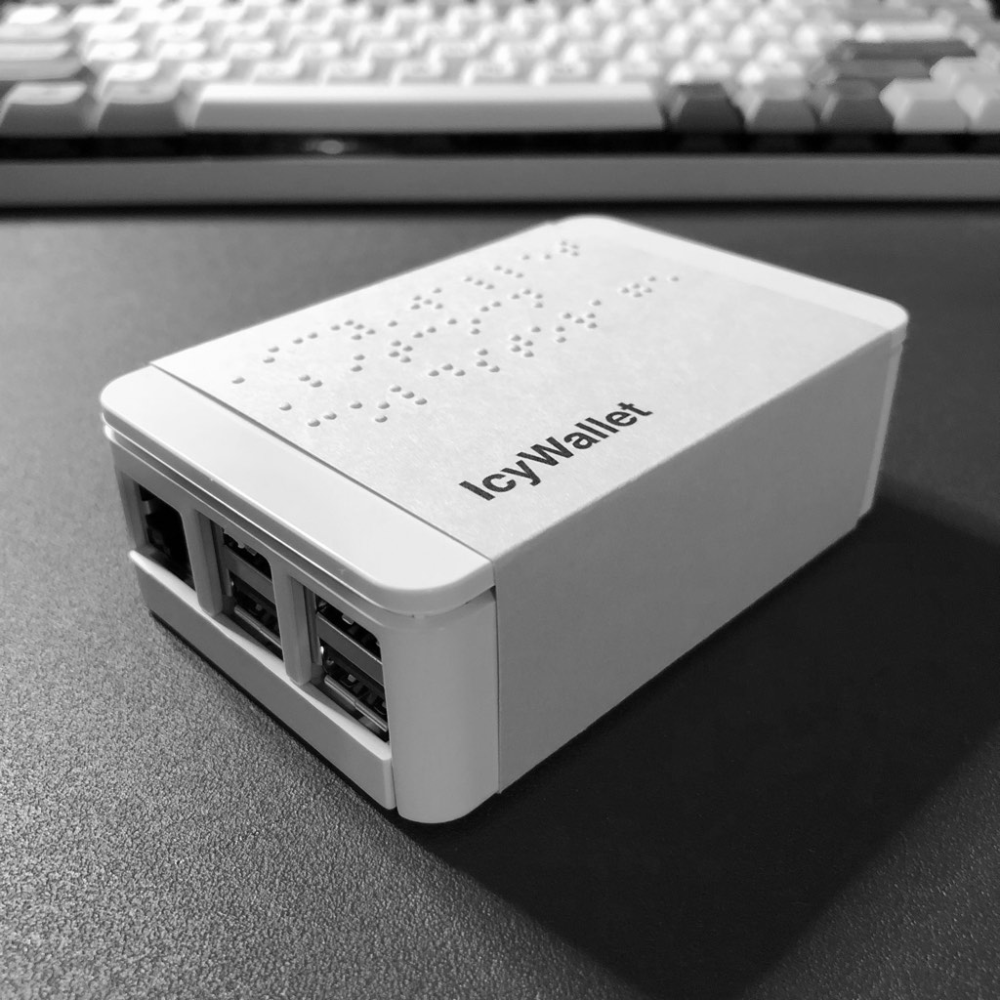
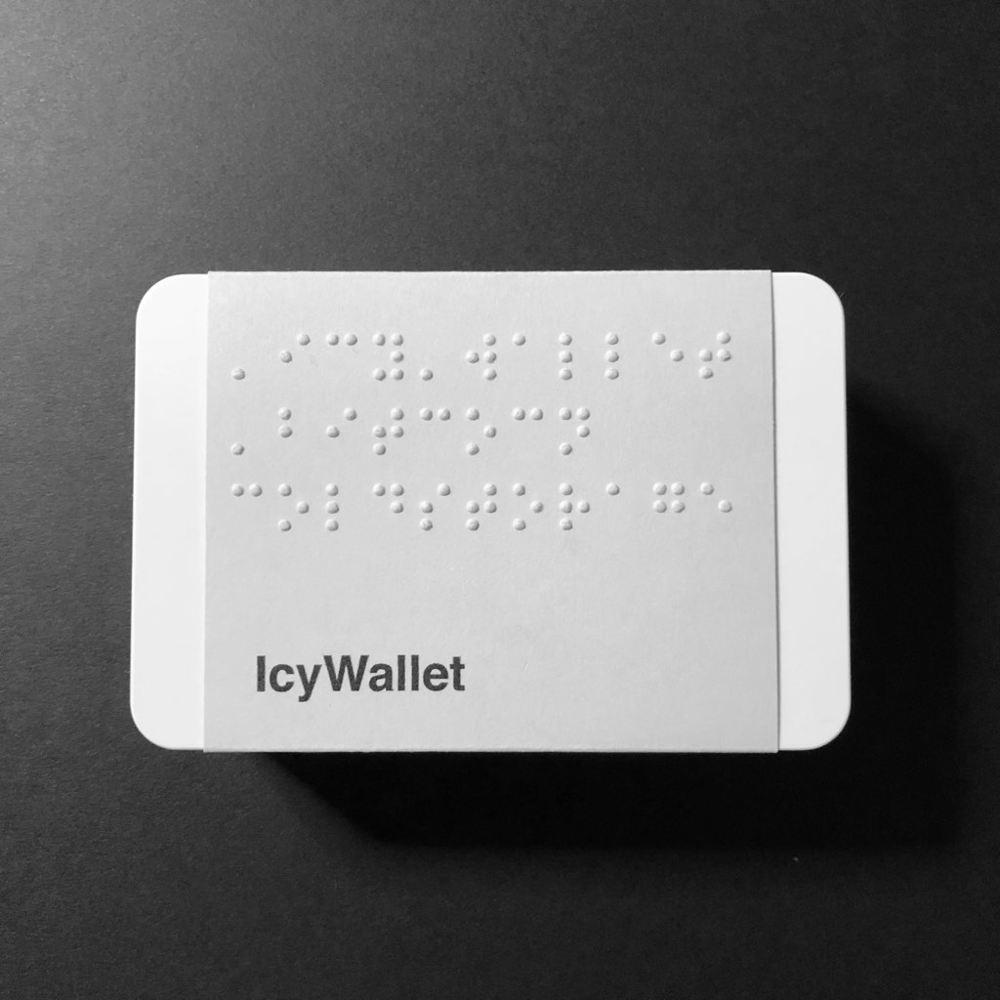

# IcyWallet 

_The screen-free, audio-friendly, fully-accessible Bitcoin cold storage solution._

Finally, a Bitcoin cold storage wallet that doesn’t require sight. From seed to spend, IcyWallet aims to be the simplest and most secure Bitcoin cold storage solution—with a total emphasis on accessibility. Just plug in headphones and a keyboard, or a refreshable braille display, and get going.

## Features

* Completely [open source](https://github.com/pugsh/IcyWallet)
* Boots directly into the wallet app with functioning audio and braille support (via [BRLTTY](https://github.com/brltty/brltty))
* All interactions designed for the best possible accessible experience
* Generates hierarchical deterministic wallets with mnemonic seeds for safe backup
* Uses the proven and reliable [BitcoinJS](https://bitcoinjs.org) library

## Audio Previews

* [Start-up](previews/welcome.mp3)
* [Intro to the wallet creation process](previews/new_wallet.mp3)
* [Seed word generation](previews/seed_word.mp3)

## Development

### Current Status

Development is underway and you can view the [master branch commits](https://github.com/pugsh/IcyWallet/commits/master) for the latest activity. The [master branch](https://github.com/pugsh/IcyWallet/tree/master) is the active development branch, **which should should not be used with coins** (but is ideal for testing). There is no stable release at this time.

  

### Progress

| Item                                       | Status  | Notes                            | Updated    |
| ------------------------------------------ | ------- | -------------------------------- | ---------- |
| Wallet generation                          | 100%    | Complete                         | 2017-11-21 |
| Mnemonic backup seed issuance              | 90%     | Wrapping up confirmation process | 2017-11-21 |
| Voice procurement process                  | Pending |                                  |            |
| Config: Voice speed                        | Pending |                                  |            |
| Config: Refreshable braille display model  | Pending |                                  |            |
| Fee estimation                             | Pending |                                  |            |
| Data movement process                      | Pending |                                  |            |
| Transaction signing                        | Pending |                                  |            |
| Upgrade process                            | Pending |                                  |            |
| Language localization                      | Pending |                                  |            |

## License

This project is licensed under the [MIT License](LICENSE.md).

## Author

IcyWallet is a [Pug](https://pug.sh) project, by [Adam Newbold](https://github.com/newbold).